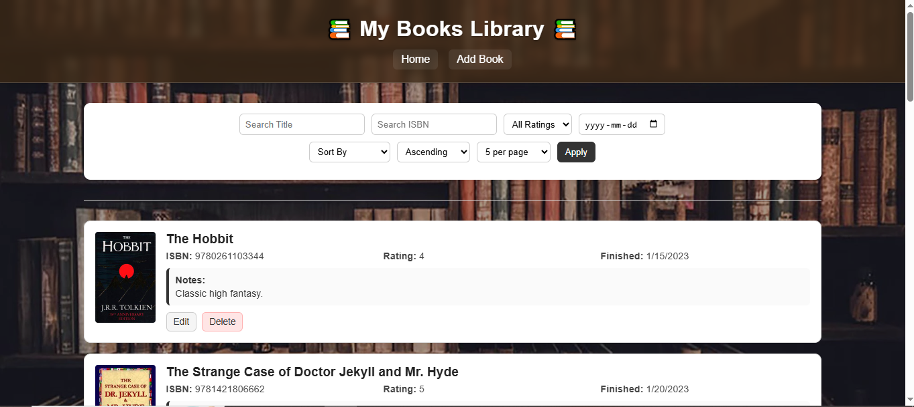
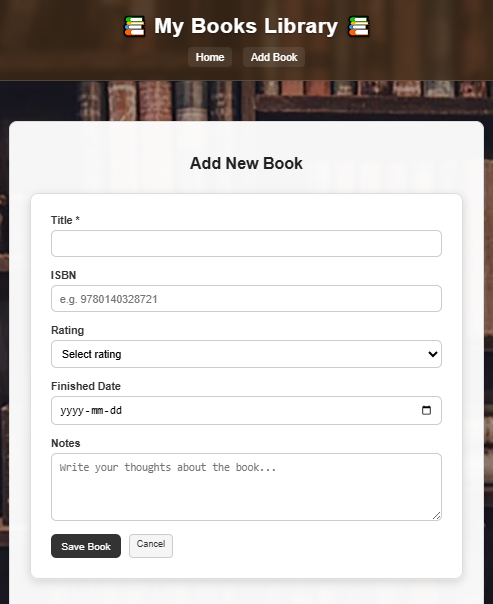

# My Books Library

A full-stack book tracking and book review web application where users can:

- Add books user has read
- Edit entries
- Delete books
- Store notes and ratings
- View Open Library book covers
- Sort and filter books
- Browse paginated results

Built using Node.js, Express, EJS, PostgreSQL, and deployed with Render + Neon.

---

# Features

- Full CRUD functionality
- PostgreSQL database persistence
- Open Library Covers API integration
- Pagination support
- Sorting by:
  - Title
  - Rating
  - ISBN
  - Finished Date
  - Created Date
- Filtering support
- Responsive mobile-friendly layout
- Styled UI with custom CSS
- Confirmation prompts for deleting books

---

# Tech Stack

## Backend

- Node.js
- Express.js
- PostgreSQL
- pg
- express-validator
- method-override

## Frontend

- EJS
- CSS
- express-ejs-layouts

## Deployment

- Render
- Neon PostgreSQL

---

# Screenshots

```markdown


```

---

# Installation

Clone the repository:

```bash
git clone https://github.com/MathieuSmuk/bookshelf-tracker.git
```

Install dependencies:

```bash
npm install
```

---

# Environment Variables

Create a `.env` file in the root directory:

```env
PORT=3000

DB_HOST=localhost
DB_PORT=5432
DB_NAME=reviews
DB_USER=postgres
DB_PASSWORD=your_password_here
```

---

# Database Setup

Create a PostgreSQL database.

Run your schema file:

```bash
psql -U postgres -d reviews -f src/db/schema.sql
```

---

# Running the App

Development mode with Nodemon:

```bash
npm run dev
```

Production:

```bash
npm start
```

Then open:

```text
http://localhost:3000/books
```

---

# Live Demo

```text
https://bookshelf-tracker.onrender.com
```

---

# API Used

Open Library Covers API:

https://openlibrary.org/dev/docs/api/covers

---

# Author

Created by Mathieu Smuk

GitHub:
https://github.com/MathieuSmuk
